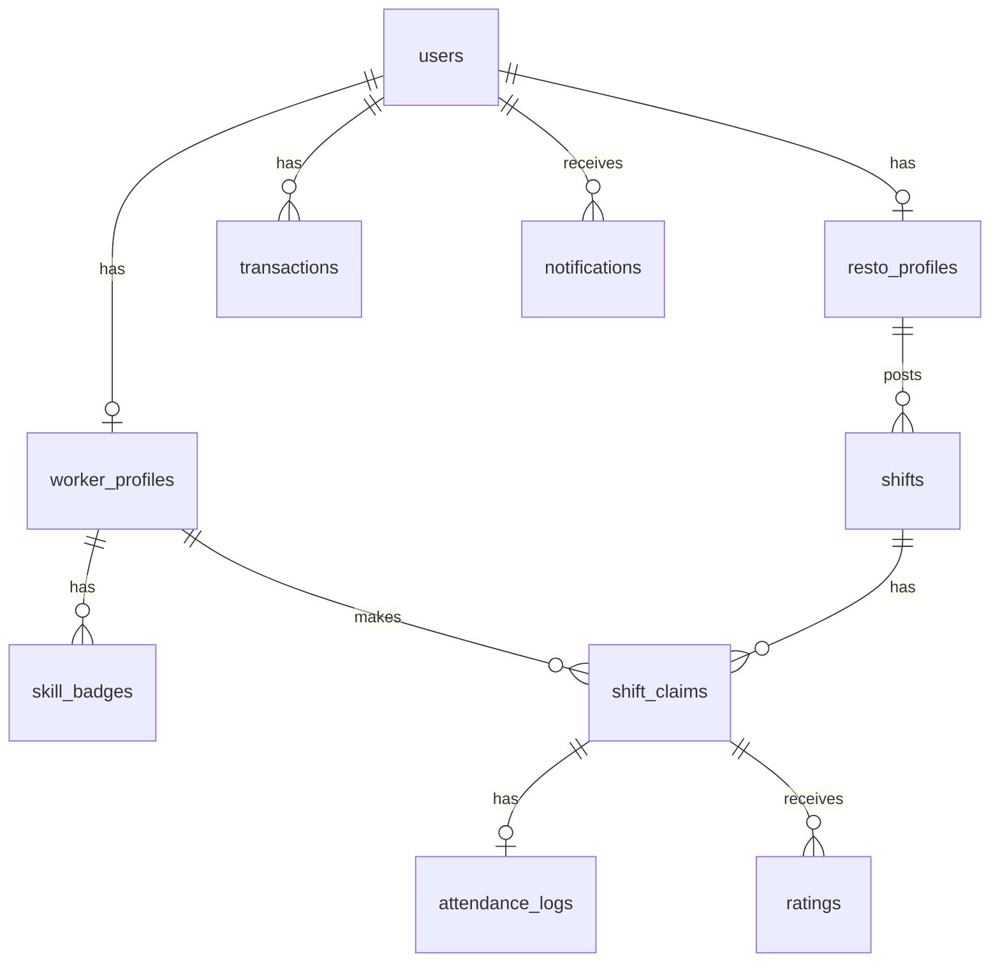

# 🍽️ On-Demand FnB Staffing Yogyakarta

Platform dua sisi (Employer/Resto ↔ Worker/Mahasiswa) untuk penyaluran pekerja paruh waktu harian di industri F&B Yogyakarta.

---

## 📐 Arsitektur Sistem

```
┌─────────────────┐    REST API    ┌─────────────────────────────────┐
│  Dashboard Web  │◄──────────────►│                                 │
│  (Next.js)      │                │      Backend API                │
└─────────────────┘                │   (Node.js + Express)           │
                                   │                                 │
┌─────────────────┐    REST API    │  ┌──────────────────────────┐   │
│  Mobile App     │◄──────────────►│  │  Matching Engine (Geo)   │   │
│  (React Native) │                │  │  Attendance Anti-Fraud   │   │
└─────────────────┘                │  │  Settlement Engine       │   │
                                   │  │  No-Show Handler (Cron)  │   │
                                   │  └──────────────────────────┘   │
                                   └──────────────┬──────────────────┘
                                                  │
                          ┌───────────────────────┼───────────────────────┐
                          ▼                       ▼                       ▼
                  ┌──────────────┐      ┌──────────────┐      ┌──────────────┐
                  │  Supabase    │      │  Firebase    │      │   Xendit     │
                  │  PostgreSQL  │      │  FCM (Notif) │      │  (Payment)   │
                  │  + Auth      │      └──────────────┘      └──────────────┘
                  │  + Storage   │
                  └──────────────┘
```

## 🗂️ Struktur Direktori

```
fnb-staffing-yog/
├── backend/
│   ├── migrations/
│   │   ├── 001_initial_schema.sql      # Schema 9 tabel utama
│   │   └── 002_functions_triggers.sql  # PostgreSQL functions & triggers
│   ├── src/
│   │   ├── config/
│   │   │   ├── supabase.js             # Supabase client (admin + anon)
│   │   │   ├── firebase.js             # FCM Admin SDK
│   │   │   └── xendit.js               # Payment gateway (MOCK MVP)
│   │   ├── middleware/
│   │   │   ├── auth.middleware.js      # JWT verify + role guard
│   │   │   ├── validate.middleware.js  # Joi schema validation
│   │   │   └── error.middleware.js     # Global error handler
│   │   ├── modules/
│   │   │   ├── shifts/                 # ✅ Modul A: Matching Engine
│   │   │   │   ├── shift.service.js   # Business logic + FCM trigger
│   │   │   │   ├── shift.controller.js
│   │   │   │   ├── shift.routes.js
│   │   │   │   └── shift.validator.js
│   │   │   └── attendance/             # ✅ Modul B+C: Anti-Fraud + Settlement
│   │   │       ├── attendance.service.js
│   │   │       ├── attendance.controller.js
│   │   │       └── attendance.routes.js
│   │   ├── jobs/                       # ✅ Modul D: Background Jobs
│   │   │   ├── shift-reminder.job.js  # Reminder H-2 jam
│   │   │   ├── no-show-handler.job.js # Auto-cancel + aktivasi standby
│   │   │   └── index.js
│   │   ├── services/
│   │   │   ├── fcm.service.js          # Push notification (mock-ready)
│   │   │   └── xendit.service.js       # Payment mock
│   │   └── utils/
│   │       ├── geo.utils.js            # Haversine formula
│   │       ├── salary.utils.js         # Kalkulasi gaji & settlement
│   │       └── logger.js               # Winston logger
│   ├── tests/
│   │   ├── salary-calculation.test.js  # ✅ 20+ unit tests
│   │   └── geofencing.test.js          # ✅ 15+ unit tests
│   ├── .env.example
│   ├── package.json
│   └── src/
│       ├── app.js                      # Express setup
│       └── server.js                   # Entry point
├── dashboard/                          # Next.js (skeleton)
├── mobile/                             # React Native (skeleton)
└── README.md
```

## 🚀 Quick Start

### 1. Setup Backend

```bash
cd backend

# Install dependencies
npm install

# Setup environment
cp .env.example .env
# Edit .env dengan kredensial Supabase kamu

# Jalankan migrasi database
# Buka Supabase Studio → SQL Editor
# Jalankan: migrations/001_initial_schema.sql
# Jalankan: migrations/002_functions_triggers.sql

# Jalankan server (development)
npm run dev
```

### 2. Jalankan Tests

```bash
cd backend
npm test

# Dengan coverage report
npm run test:coverage
```

Server akan berjalan di `http://localhost:3000`

---

## 📡 API Endpoints

### Shifts (Modul A — Matching Engine)

| Method | Endpoint | Role | Deskripsi |
|--------|----------|------|-----------|
| `POST` | `/api/shifts` | RESTO | Buat shift baru + trigger matching engine |
| `GET` | `/api/shifts` | WORKER | Lihat daftar shift terbuka |
| `GET` | `/api/shifts/my` | RESTO | Shift milik resto yang login |
| `GET` | `/api/shifts/:id` | ALL | Detail satu shift |
| `POST` | `/api/shifts/claim` | WORKER | Klaim/daftar shift |
| `PATCH` | `/api/shifts/confirm` | WORKER | Konfirmasi kehadiran H-2 jam |

### Attendance (Modul B + C — Anti-Fraud + Settlement)

| Method | Endpoint | Role | Deskripsi |
|--------|----------|------|-----------|
| `POST` | `/api/attendance/check-in` | WORKER | Check-in 3 lapis (GPS + QR/PIN + Selfie) |
| `POST` | `/api/attendance/check-out` | WORKER | Check-out + settlement gaji otomatis |

### Health Check

| Method | Endpoint | Deskripsi |
|--------|----------|-----------|
| `GET` | `/health` | Server status |

---

## 📊 Database Schema



---

## 💡 Fitur Utama MVP

### ✅ Modul A: Matching Engine Cerdas
- Filter worker dalam radius 5 KM (Haversine Formula)
- Syarat: SkillBadge verified + Rating ≥ 4.5
- **Early Access Tier System:**
  - 🥇 **PLATINUM**: Notif langsung (0 menit)
  - 🥈 **GOLD**: Notif setelah 5 menit
  - 🥉 **SILVER/BRONZE**: Notif setelah 15 menit

### ✅ Modul B: Check-In Anti-Fraud (3 Lapis)
1. **GPS Haversine**: Harus < 50 meter dari resto
2. **QR Code** (HMAC-SHA256 daily rotating) **atau PIN 4 digit**
3. **Foto Selfie** (upload ke Supabase Storage)

### ✅ Modul C: Settlement Otomatis
- Pembulatan durasi kerja per 15 menit
- Potong deposit resto = Gaji + Service Fee (Rp 3.000/jam)
- Transfer instan ke wallet worker (atomic PostgreSQL transaction)

### ✅ Modul D: No-Show Fail-Safe
- Reminder H-2 jam via FCM
- Grace period 20 menit untuk CONFIRM
- Auto-promote worker STANDBY + kompensasi Rp 5.000

---

## 🔐 Environment Variables Penting

| Variabel | Default | Keterangan |
|----------|---------|------------|
| `PLATFORM_SERVICE_FEE_PER_HOUR` | `3000` | Fee platform per jam (Rupiah) |
| `MAX_WORKER_SEARCH_RADIUS_KM` | `5` | Radius max pencarian worker |
| `MIN_WORKER_RATING` | `4.5` | Minimum rating worker |
| `GEOFENCE_CHECKIN_RADIUS_METERS` | `50` | Radius geofence check-in |
| `NO_SHOW_GRACE_PERIOD_MINUTES` | `20` | Grace period setelah reminder |
| `XENDIT_MOCK` | `true` | Mode mock Xendit |

---

## 📦 Tech Stack

| Layer | Teknologi |
|-------|-----------|
| Runtime | Node.js 18+ |
| Framework | Express.js 4 |
| Database | PostgreSQL (Supabase) |
| Auth | Supabase Auth (JWT) |
| Storage | Supabase Storage |
| Push Notif | Firebase Cloud Messaging |
| Payment | Xendit (MOCK untuk MVP) |
| Validation | Joi |
| Logging | Winston |
| Testing | Jest + Supertest |
| Scheduler | node-cron |

---

## 🧪 Test Results

```
PASS tests/salary-calculation.test.js
  roundDurationMinutes
    ✓ 61 menit dibulatkan ke 60 menit
    ✓ 67 menit dibulatkan ke 75 menit
    ✓ 90 menit tetap 90 menit
    ✓ 0 menit mengembalikan 0
    ... (8 tests)

  calculateWorkDuration
    ✓ 4 jam kerja dihitung dengan benar
    ✓ melempar error jika check-out sebelum check-in
    ... (5 tests)

  calculateSettlement
    ✓ shift 8 jam rate Rp 20.000 — perhitungan lengkap
    ✓ pembulatan 3 jam 20 menit → 3 jam 15 menit
    ... (3 tests)

PASS tests/geofencing.test.js
  haversineDistance
    ✓ jarak ke titik yang sama adalah 0
    ✓ titik ~35 meter dari Malioboro
    ✓ Kaliurang ke Malioboro ~15 km
    ✓ fungsi bersifat simetrik
    ... (5 tests)

  isWithinGeofence
    ✓ worker ~35m dari resto → VALID
    ✓ worker ~150m dari resto → INVALID
    ... (5 tests)

  filterWorkersInRadius
    ✓ filter workers dalam radius 5 KM
    ✓ hasil diurutkan dari yang terdekat
    ... (5 tests)
```

---

## 📌 Roadmap Pasca MVP

- [ ] Auth module (registrasi worker/resto + OTP phone)
- [ ] Worker profile CRUD + KTP/KTM verification
- [ ] Skill Badge quiz engine
- [ ] Rating & review module
- [ ] Xendit integration (production)
- [ ] Firebase FCM (production)
- [ ] Dashboard Next.js (frontend)
- [ ] React Native mobile app
- [ ] WhatsApp Business notifikasi
- [ ] Admin panel

---

*Dibuat untuk presentasi client — MVP On-Demand FnB Staffing Yogyakarta*
